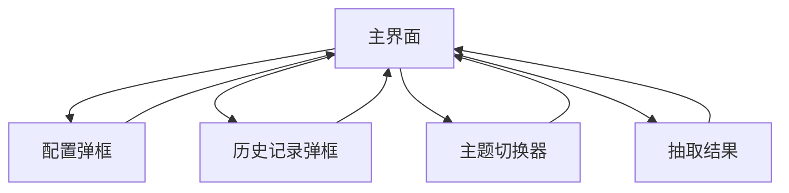

# 老虎机转盘应用产品需求文档

## 1. 产品概述

一个基于Web的单转盘老虎机应用，用户可以通过点击拨杆来随机抽取转盘中的项目。支持自定义转盘内容、本地数据存储和历史记录功能。

该产品旨在为用户提供一个有趣的随机选择工具，可用于决策辅助、游戏娱乐或团队活动等场景。

## 2. 核心功能

### 2.1 用户角色

本产品为单用户应用，无需区分用户角色，所有功能对访问者开放。

### 2.2 功能模块

我们的老虎机转盘应用包含以下主要功能：
1. **主界面**：老虎机界面、转盘显示、拨杆控制、结果展示、主题切换
2. **配置弹框**：转盘项目管理、默认配置、自定义设置（弹框形式）
3. **历史记录弹框**：历史抽取记录、统计信息（弹框形式）
4. **多主题系统**：支持多种视觉主题切换，包含不同的动画效果和美术风格

### 2.3 功能详情

| 界面/模块 | 功能名称 | 功能描述 |
|----------|----------|----------|
| 主界面 | 老虎机界面 | 展示老虎机外观，支持多主题切换，包含转盘区域和拨杆控制 |
| 主界面 | 转盘显示 | 显示当前转盘项目，支持图片+文案或纯文案格式，根据主题变化样式 |
| 主界面 | 拨杆控制 | 点击拨杆启动转盘动画，随机选择项目，不同主题有不同动画效果 |
| 主界面 | 结果展示 | 显示抽取结果，包含主题化的动画效果和音效 |
| 主界面 | 主题切换器 | 顶部主题选择按钮，支持实时切换不同视觉主题 |
| 主界面 | 功能按钮 | 配置按钮和历史记录按钮，点击弹出对应弹框 |
| 配置弹框 | 默认配置 | 提供预设的转盘项目配置选项，弹框形式展示 |
| 配置弹框 | 自定义设置 | 添加、编辑、删除转盘项目，支持图片上传和文案编辑 |
| 配置弹框 | 本地存储 | 将自定义配置保存到浏览器本地存储 |
| 历史记录弹框 | 记录列表 | 显示历史抽取记录，包含时间戳和结果，弹框形式展示 |
| 历史记录弹框 | 统计信息 | 显示抽取次数、各项目命中率等统计数据 |

## 3. 核心流程

**主要用户操作流程：**
用户访问主界面 → 选择喜欢的主题 → 查看当前转盘配置 → 点击拨杆启动抽取 → 观看主题化转盘动画 → 查看抽取结果 → 结果自动保存到历史记录

**配置管理流程：**
用户在主界面点击配置按钮 → 弹出配置弹框 → 选择默认配置或创建自定义配置 → 添加/编辑转盘项目 → 保存配置到本地存储 → 关闭弹框返回主界面使用新配置

**历史记录查看流程：**
用户在主界面点击历史记录按钮 → 弹出历史记录弹框 → 浏览历史抽取记录 → 查看统计信息 → 可选择清空历史记录 → 关闭弹框返回主界面

**主题切换流程：**
用户在主界面点击主题切换器 → 选择不同主题 → 界面实时切换视觉效果 → 主题偏好自动保存到本地

## 4. 用户界面设计

### 4.1 设计风格

#### 4.1.1 多主题系统
应用支持多种视觉主题，用户可以实时切换：

**经典主题（默认）**
- **主色调**：金色 (#FFD700) 和红色 (#DC143C)，营造经典老虎机氛围
- **辅助色**：深蓝色 (#1E3A8A) 和银色 (#C0C0C0)
- **风格特点**：复古老虎机外观，金属质感，闪烁灯光效果

**现代主题**
- **主色调**：渐变蓝色 (#667eea 到 #764ba2) 和白色 (#FFFFFF)
- **辅助色**：深灰色 (#2D3748) 和浅灰色 (#E2E8F0)
- **风格特点**：简约现代，扁平化设计，柔和渐变

**暗黑主题**
- **主色调**：深紫色 (#1A202C) 和霓虹绿 (#00FF88)
- **辅助色**：炭黑色 (#171923) 和银色 (#A0AEC0)
- **风格特点**：科技感，霓虹灯效果，暗色背景

**彩虹主题**
- **主色调**：彩虹渐变色和白色背景
- **辅助色**：柔和粉色系
- **风格特点**：活泼可爱，彩色动画，适合年轻用户

#### 4.1.2 通用设计元素
- **按钮风格**：3D立体效果，圆角设计，具有按压反馈，根据主题调整颜色
- **字体**：主标题使用粗体，正文使用14-16px，移动端适配12-14px
- **布局风格**：单页面应用，弹框式交互，响应式设计
- **图标风格**：使用主题化图标，配合适当的阴影和发光效果

### 4.2 界面设计概览

| 界面/模块 | 功能名称 | UI元素 |
|----------|----------|--------|
| 主界面 | 老虎机界面 | 主题化边框和外观，3D阴影效果，居中布局，支持4种主题风格 |
| 主界面 | 转盘显示 | 圆形转盘，项目均匀分布，当前指向项目高亮显示，主题化颜色和动画 |
| 主界面 | 拨杆控制 | 右侧主题化拨杆，点击时有下压动画，配合主题音效 |
| 主界面 | 主题切换器 | 顶部圆形主题选择按钮，悬浮显示主题预览，点击切换 |
| 主界面 | 功能按钮区 | 底部配置和历史记录按钮，主题化样式，图标+文字 |
| 配置弹框 | 弹框容器 | 居中半透明遮罩，圆角白色弹框，关闭按钮，响应式尺寸 |
| 配置弹框 | 项目管理 | 列表式布局，每项包含预览图、文案和操作按钮，拖拽排序 |
| 历史记录弹框 | 弹框容器 | 居中半透明遮罩，圆角白色弹框，关闭按钮，响应式尺寸 |
| 历史记录弹框 | 记录展示 | 时间线式布局，每条记录显示时间、结果和图标，分页显示 |

### 4.3 响应式设计

产品采用移动端优先的响应式设计，支持桌面端和移动端双端适配：
- **桌面端**：1200px以上宽度，横向布局，鼠标交互优化
- **平板端**：768px-1199px宽度，适中布局，触摸交互优化
- **移动端**：767px以下宽度，纵向布局，手指触摸优化，增大按钮尺寸