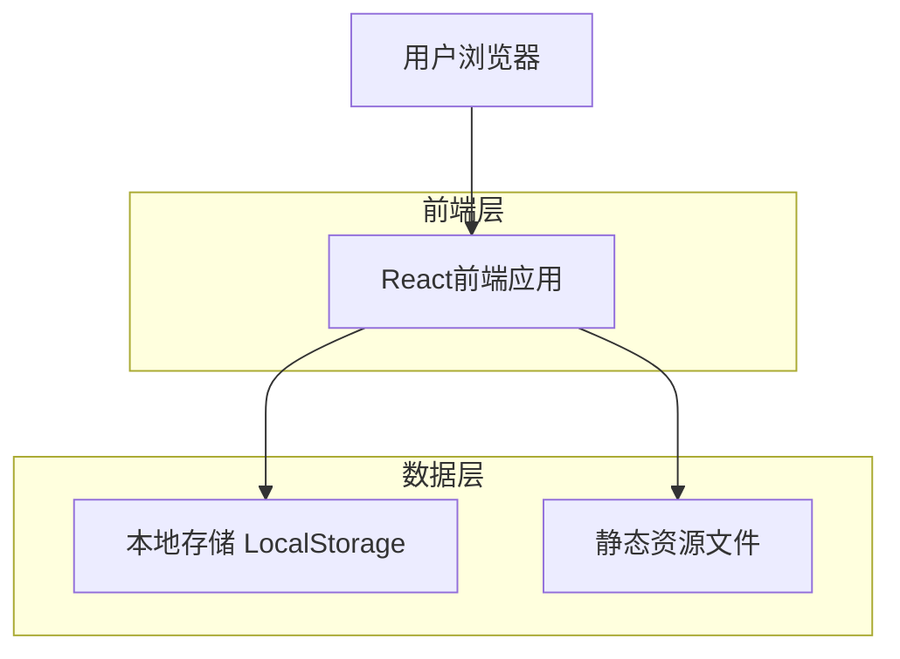
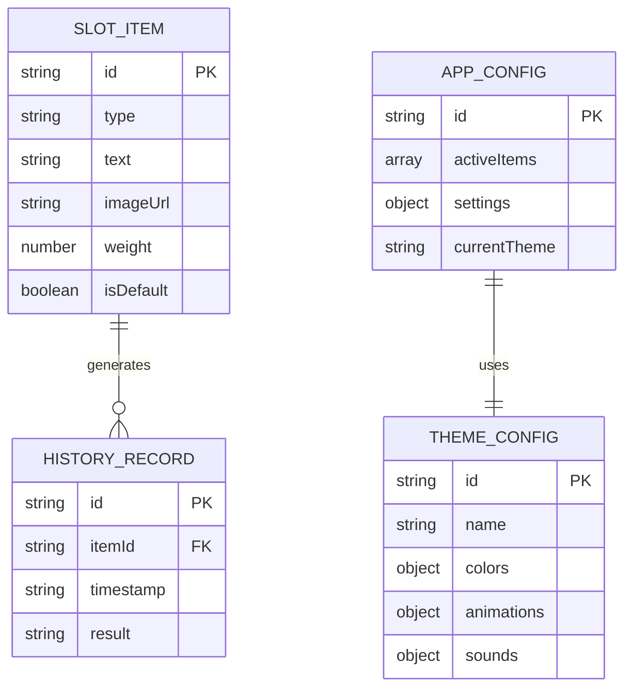

# 老虎机转盘应用技术架构文档

## 1. 架构设计



## 2. 技术描述

- 前端：React@18 + TypeScript + Tailwind CSS + Vite
- 数据存储：浏览器 LocalStorage
- 动画库：Framer Motion
- 音效：Web Audio API
- 部署：GitHub Pages

## 3. 路由定义

| 路由 | 用途 |
|------|------|
| / | 主界面，显示老虎机界面、转盘操作、主题切换和弹框管理 |

注：配置和历史记录功能通过弹框实现，不需要独立路由

## 4. 数据模型

### 4.1 数据模型定义



### 4.2 数据定义

**转盘项目数据结构 (SlotItem)**
```typescript
interface SlotItem {
  id: string;           // 唯一标识符
  type: 'text' | 'image-text'; // 项目类型
  text: string;         // 显示文案
  imageUrl?: string;    // 图片URL（可选）
  weight: number;       // 权重，影响抽中概率
  isDefault: boolean;   // 是否为默认配置项目
}
```

**历史记录数据结构 (HistoryRecord)**
```typescript
interface HistoryRecord {
  id: string;           // 记录唯一标识
  itemId: string;       // 抽中项目的ID
  timestamp: string;    // 抽取时间戳
  result: string;       // 抽取结果文案
}
```

**应用配置数据结构 (AppConfig)**
```typescript
interface AppConfig {
  id: string;           // 配置标识
  activeItems: string[]; // 当前激活的项目ID列表
  currentTheme: string; // 当前选中的主题ID
  settings: {
    animationDuration: number; // 动画持续时间
    soundEnabled: boolean;     // 是否启用音效
    vibrationEnabled: boolean; // 是否启用震动反馈（移动端）
  };
  uiState: {
    configModalOpen: boolean;  // 配置弹框是否打开
    historyModalOpen: boolean; // 历史记录弹框是否打开
  };
}
```

**主题配置数据结构 (ThemeConfig)**
```typescript
interface ThemeConfig {
  id: string;           // 主题唯一标识
  name: string;         // 主题显示名称
  colors: {
    primary: string;    // 主色调
    secondary: string;  // 辅助色
    background: string; // 背景色
    text: string;       // 文字色
    accent: string;     // 强调色
  };
  animations: {
    wheelSpin: string;  // 转盘旋转动画类型
    leverPull: string;  // 拉杆动画类型
    resultShow: string; // 结果展示动画类型
  };
  sounds: {
    spin: string;       // 转盘音效文件
    win: string;        // 中奖音效文件
    click: string;      // 点击音效文件
  };
}
```

**本地存储键值定义**
```typescript
const STORAGE_KEYS = {
  SLOT_ITEMS: 'slot_items',        // 转盘项目列表
  HISTORY_RECORDS: 'history_records', // 历史记录
  APP_CONFIG: 'app_config',        // 应用配置
  CUSTOM_ITEMS: 'custom_items',    // 用户自定义项目
  CURRENT_THEME: 'current_theme',  // 当前选中主题
  THEME_CONFIGS: 'theme_configs'   // 主题配置列表
};
```

**默认配置数据**
```typescript
const DEFAULT_ITEMS: SlotItem[] = [
  {
    id: 'default_1',
    type: 'text',
    text: '大吉大利',
    weight: 1,
    isDefault: true
  },
  {
    id: 'default_2', 
    type: 'text',
    text: '再来一次',
    weight: 1,
    isDefault: true
  },
  {
    id: 'default_3',
    type: 'text', 
    text: '恭喜发财',
    weight: 1,
    isDefault: true
  },
  {
    id: 'default_4',
    type: 'text',
    text: '心想事成',
    weight: 1,
    isDefault: true
  },
  {
    id: 'default_5',
    type: 'text',
    text: '万事如意',
    weight: 1,
    isDefault: true
  },
  {
    id: 'default_6',
    type: 'text',
    text: '好运连连',
    weight: 1,
    isDefault: true
  }
];
```

## 5. 核心功能实现

### 5.1 转盘抽取算法
```typescript
// 基于权重的随机抽取算法
function weightedRandomSelect(items: SlotItem[]): SlotItem {
  const totalWeight = items.reduce((sum, item) => sum + item.weight, 0);
  let random = Math.random() * totalWeight;
  
  for (const item of items) {
    random -= item.weight;
    if (random <= 0) {
      return item;
    }
  }
  
  return items[items.length - 1]; // 兜底返回最后一项
}
```

### 5.2 本地存储管理
```typescript
class StorageManager {
  static save<T>(key: string, data: T): void {
    localStorage.setItem(key, JSON.stringify(data));
  }
  
  static load<T>(key: string, defaultValue: T): T {
    const stored = localStorage.getItem(key);
    return stored ? JSON.parse(stored) : defaultValue;
  }
  
  static remove(key: string): void {
    localStorage.removeItem(key);
  }
}
```

### 5.3 主题管理系统
```typescript
// 主题管理器
class ThemeManager {
  private static themes: ThemeConfig[] = [
    {
      id: 'classic',
      name: '经典主题',
      colors: {
        primary: '#FFD700',
        secondary: '#DC143C',
        background: '#1E3A8A',
        text: '#FFFFFF',
        accent: '#C0C0C0'
      },
      animations: {
        wheelSpin: 'classic-spin',
        leverPull: 'classic-pull',
        resultShow: 'classic-result'
      },
      sounds: {
        spin: '/sounds/classic-spin.mp3',
        win: '/sounds/classic-win.mp3',
        click: '/sounds/classic-click.mp3'
      }
    },
    {
      id: 'modern',
      name: '现代主题',
      colors: {
        primary: '#667eea',
        secondary: '#764ba2',
        background: '#FFFFFF',
        text: '#2D3748',
        accent: '#E2E8F0'
      },
      animations: {
        wheelSpin: 'modern-spin',
        leverPull: 'modern-pull',
        resultShow: 'modern-result'
      },
      sounds: {
        spin: '/sounds/modern-spin.mp3',
        win: '/sounds/modern-win.mp3',
        click: '/sounds/modern-click.mp3'
      }
    }
    // 其他主题配置...
  ];

  static getCurrentTheme(): ThemeConfig {
    const currentThemeId = StorageManager.load(STORAGE_KEYS.CURRENT_THEME, 'classic');
    return this.themes.find(theme => theme.id === currentThemeId) || this.themes[0];
  }

  static setTheme(themeId: string): void {
    StorageManager.save(STORAGE_KEYS.CURRENT_THEME, themeId);
    this.applyTheme(themeId);
  }

  static applyTheme(themeId: string): void {
    const theme = this.themes.find(t => t.id === themeId);
    if (theme) {
      // 应用CSS变量
      document.documentElement.style.setProperty('--primary-color', theme.colors.primary);
      document.documentElement.style.setProperty('--secondary-color', theme.colors.secondary);
      document.documentElement.style.setProperty('--background-color', theme.colors.background);
      document.documentElement.style.setProperty('--text-color', theme.colors.text);
      document.documentElement.style.setProperty('--accent-color', theme.colors.accent);
    }
  }
}
```

### 5.4 弹框管理系统
```typescript
// 弹框管理器
class ModalManager {
  static openConfigModal(): void {
    const config = StorageManager.load(STORAGE_KEYS.APP_CONFIG, {});
    config.uiState = { ...config.uiState, configModalOpen: true };
    StorageManager.save(STORAGE_KEYS.APP_CONFIG, config);
  }

  static closeConfigModal(): void {
    const config = StorageManager.load(STORAGE_KEYS.APP_CONFIG, {});
    config.uiState = { ...config.uiState, configModalOpen: false };
    StorageManager.save(STORAGE_KEYS.APP_CONFIG, config);
  }

  static openHistoryModal(): void {
    const config = StorageManager.load(STORAGE_KEYS.APP_CONFIG, {});
    config.uiState = { ...config.uiState, historyModalOpen: true };
    StorageManager.save(STORAGE_KEYS.APP_CONFIG, config);
  }

  static closeHistoryModal(): void {
    const config = StorageManager.load(STORAGE_KEYS.APP_CONFIG, {});
    config.uiState = { ...config.uiState, historyModalOpen: false };
    StorageManager.save(STORAGE_KEYS.APP_CONFIG, config);
  }

  static closeAllModals(): void {
    const config = StorageManager.load(STORAGE_KEYS.APP_CONFIG, {});
    config.uiState = {
      configModalOpen: false,
      historyModalOpen: false
    };
    StorageManager.save(STORAGE_KEYS.APP_CONFIG, config);
  }
}
```

### 5.5 GitHub Pages 部署配置

**package.json 部署脚本**
```json
{
  "scripts": {
    "build": "vite build",
    "deploy": "npm run build && gh-pages -d dist"
  },
  "homepage": "https://[username].github.io/roll"
}
```

**vite.config.ts 配置**
```typescript
import { defineConfig } from 'vite';
import react from '@vitejs/plugin-react';

export default defineConfig({
  plugins: [react()],
  base: '/roll/', // GitHub Pages 仓库名
  build: {
    outDir: 'dist',
    assetsDir: 'assets'
  }
});
```

### 5.6 响应式设计实现

**Tailwind CSS 断点配置**
```typescript
// tailwind.config.js
module.exports = {
  theme: {
    screens: {
      'sm': '640px',   // 移动端
      'md': '768px',   // 平板端  
      'lg': '1024px',  // 桌面端
      'xl': '1280px'   // 大屏桌面端
    }
  }
};
```

**组件响应式样式示例**
```typescript
// 老虎机主容器响应式样式
const slotMachineStyles = {
  container: "w-full max-w-md mx-auto md:max-w-2xl lg:max-w-4xl",
  wheel: "w-64 h-64 md:w-80 md:h-80 lg:w-96 lg:h-96",
  lever: "w-12 h-24 md:w-16 md:h-32 lg:w-20 lg:h-40"
};
```